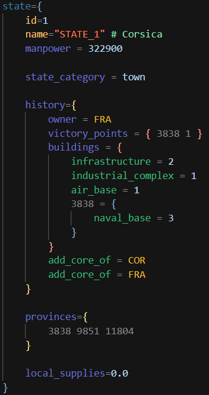
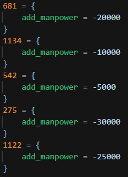
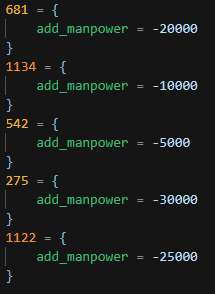

# STupidLord's Hearts of Iron 4 Syntax Highlighting

**STupidLord's Hearts of Iron 4 Syntax Highlighting** is a extention made to highlight your HoI4 code in a simple way.

If you encounter any missing highlighting feel free to make an [issue](https://github.com/STupidLord/HoI4-Syntax/issues).

## Features

The main and currently only function of this extension is highlighting the various pieces of code for HoI4. It also includes a way to add your own custom syntax, i.e. for custom ideologies, scripted effects, missing syntax, ect.

### Recommended extensions to pair with
- **[Rainbow CSV](https://marketplace.visualstudio.com/items?itemName=mechatroner.rainbow-csv)**

### Themes
- HoI4 Dark
- HoI4 Light - p.s. I'm not a light mode user so I don't know exactly what people look for in a light theme

### State History Example

### Focus Tree Example

## How to add custom syntax?

1. Custom syntax is added in the [user.tmLanguage.json](syntaxes/user.tmLanguage.json) file. To find this on your device, it should be located at `%USERPROFILE%\.vscode\extensions\stupidlord.stupid-hoi4-syntax-1.1.0\syntaxes`
2. Once you have that file open, find the appropreiate syntax to add to.
3. To add your syntax; replace the `PLACEHOLDERSOTHISDOESNTMATCHANYTHINGREMOVETHISTOADDYOUROWNTHINGS` string inside of `"match": "\\b()\\b"` with your desired text
    1. To add multiple sets of text use the pipe symbol `|` as a devider
    2. For more advanced syntax you can reference [Regular Expression Language - Quick Reference](https://learn.microsoft.com/en-us/dotnet/standard/base-types/regular-expression-language-quick-reference) and [Language Grammars](https://macromates.com/manual/en/language_grammars)
4. Restart VSCode or use the `Developer: Reload Window` command

Warning, updates may overwrite your `user.tmLanguage.json` file, make backups if you are worried about losing it or have a lot of custom syntax!

## Release Notes

[Full changelog](https://github.com/STupidLord/stupidlord.hoi4-syntax/blob/master/CHANGELOG.md)

### 1.2.0

The *real* public release version, I swear. Finally went through and copied the effects, modifiers, and triggers from the base game documentation so it should now have almost if not every base game thing to highlight.

### 1.2.1

Minor fixes to fix comments and some other things

### 1.3.0

Added coloring for `.yml` loc files after being pestered by my lead dev and another dev for the mod I work on.

### 1.3.1

Fixed loc highlighting being broken if you had a colon after the loc string (e.x. having `# TODO:` at the end of the line)

### 1.3.2

Fixed an issue where three number states would be highlighted with the color of tags. (Hid pre 1.2.0 updates to condense [Release Notes](#release-notes))

Before:

After:

## Credits

This extension takes heavy inspiration from **Thomas Boby's [Paradox Syntax Highlighting](https://github.com/cwtools/paradox-syntax)**, credit to him for being the reason I started making this.